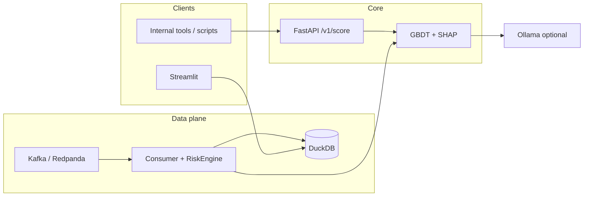

# RiskLens AI

[](https://www.python.org/)
[](https://fastapi.tiangolo.com/)
[](https://streamlit.io/)
[](https://scikit-learn.org/)
[](https://github.com/slundberg/shap)
[](https://duckdb.org/)
[](https://www.docker.com/)
[-000000?logo=apachekafka&logoColor=white)](https://redpanda.com/)
[](https://ollama.com/)

**End-to-end fraud risk:** train a model, expose a **FastAPI** service for real request/response, stream through Kafka, store in DuckDB, and review in Streamlit—with **SHAP** explainability and an **optional Ollama** narrative for “so what?” context.

> **GitHub About (one line):** Real-time fraud risk API + SHAP + optional local LLM; Kafka, DuckDB, Streamlit, deployable container.

---

## 1. Problem

Banks and risk teams need a **fast, defensible risk signal** on every payment: not a black-box score, but **input → score + drivers** so an analyst (or an automations team) can act. This project simulates that:

- A **gradient-boosted** model scores transaction features.
- **SHAP** explains *which* features moved the score (regulatory and ops-friendly).
- A **REST API** exposes the same scoring path you would wire into internal tools (CRM, case queues, orchestration).
- **Streaming** + **DuckDB** show how scores land in an analytical store for dashboards and AML-style graph views.
- **Ollama** (local) can turn structured SHAP into a short **analyst narrative**—no cloud LLM required for a demo.

This is a **portfolio / architecture demonstrator**, not a production authorization system.

---

## 2. Architecture

**Request path (what to show in an interview):** caller → **FastAPI** → in-process **ML + SHAP** → JSON (optional **LLM** layer).



| Layer | What it does |
|--------|----------------|
| **API** `src/api/main.py` | `POST /v1/score` — transaction in, **risk % + SHAP** out; `?include_narrative=true` calls Ollama if available. |
| **Engine** `src/services/risk_engine.py` | Single `RiskEngine` used by **API** and **Kafka consumer** (no duplicate model logic). |
| **Stream** | Producer → Redpanda → consumer scores and **persists** to DuckDB. |
| **UI** | Streamlit reads DuckDB; copilot uses the same Ollama client as the API narrative. |

**System view (batch + stream):**

```text
  [ HTTP client / Postman ]
        |
        v
   +------------+
   |  FastAPI   |  risk_score, shap_top, optional narrative
   +------------+
        |
   +------------+     +----------+     +---------+
   | RiskEngine |     | Redpanda | --> | Consumer | --> DuckDB --> Streamlit
   +------------+     +----------+     +---------+
```

---

## 3. Demo

### A. Train the model (once)

```bash
python -m venv .venv && source .venv/bin/activate   # Windows: .venv\Scripts\activate
pip install -r requirements.txt
python -m src.ml.train_model
```

This creates `artifacts/risk_model.joblib` (gitignored).

### B. Run the API (main “product” demo)

```bash
uvicorn src.api.main:app --reload --host 0.0.0.0 --port 8000
```

- **Interactive docs:** [http://127.0.0.1:8000/docs](http://127.0.0.1:8000/docs)
- **Health:** `GET /health`

**Score a transaction (high-risk shape — gift cards, night hour, velocity):**

```bash
curl -s -X POST "http://127.0.0.1:8000/v1/score" \
  -H "Content-Type: application/json" \
  -d @examples/api_score_request.json | jq .
```

**Include analyst narrative** (needs [Ollama](https://ollama.com) running, model pulled):

```bash
curl -s -X POST "http://127.0.0.1:8000/v1/score?include_narrative=true" \
  -H "Content-Type: application/json" \
  -d @examples/api_score_request.json | jq .
```

Optional env (Docker / cloud pointing at a remote Ollama):

```bash
export OLLAMA_HOST=http://127.0.0.1:11434
export OLLAMA_MODEL=phi3:latest
```

### C. Container (optional)

After training so `artifacts/risk_model.joblib` exists:

```bash
docker compose build api
docker compose up api
```

API at **http://localhost:8000** (Ollama on the host: set `OLLAMA_HOST` to `http://host.docker.internal:11434` on Docker Desktop).

### D. Full pipeline (stream + dashboard)

```bash
docker compose up -d
python -m src.stream.consumer_to_db
python -m src.stream.producer
streamlit run src/ui/dashboard.py
```

### E. “Live” deploy (Render / Railway / Fly)

1. Connect the GitHub repo.  
2. **Build command:** `pip install -r requirements.txt` and **run** `uvicorn src.api.main:app --host 0.0.0.0 --port $PORT` (or use the included `Procfile` on Heroku-style hosts).  
3. **Upload or build** `artifacts/risk_model.joblib` in CI (run `python -m src.ml.train_model` in a build step) or store it in a release artifact.  
4. For a **2-minute Loom-style** walkthrough, record: Swagger → `POST /v1/score` → show `shap_top` in the response.

Record a **short video** (or Loom) showing: request JSON → response with `risk_score` and `shap_top` — that is the “interview-grade” demo.

---

## Repository layout (high level)

| Path | Role |
|------|------|
| `src/api/main.py` | **FastAPI** app |
| `src/api/schemas.py` | Request/response models |
| `src/services/risk_engine.py` | **ML + SHAP** (shared) |
| `src/stream/consumer_to_db.py` | Kafka → score → DuckDB |
| `src/ui/dashboard.py` | Streamlit |
| `src/ui/llm.py` | Ollama client (`OLLAMA_HOST`, `OLLAMA_MODEL`) |
| `Dockerfile.api` | API container |
| `docker-compose.yml` | Redpanda + optional **api** service |
| `examples/api_score_request.json` | Sample **POST** body |

---

## Why the language bar is mostly Python

GitHub counts file types; this repo is **Python-first** (API, training, UI, consumers). The **stack** is still “ML + API + stream + DB + optional LLM” — use the **badges** and this README for the system story.

---

## License

Add a `LICENSE` file if you open-source under explicit terms.
