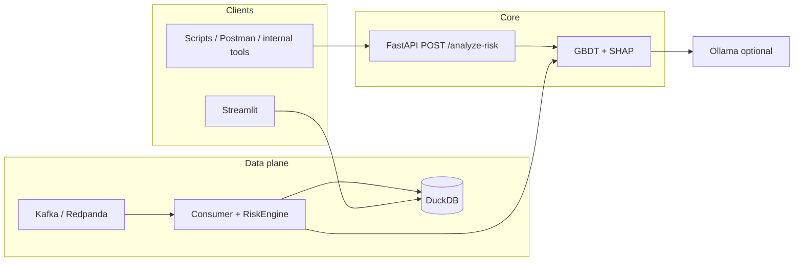

# RiskScope AI

**Original portfolio project** (not affiliated with any commercial “RiskLens” product). Repo may appear as `riskscope-ai` on GitHub.

[](https://www.python.org/)
[](https://fastapi.tiangolo.com/)
[](https://streamlit.io/)
[](https://scikit-learn.org/)
[](https://github.com/slundberg/shap)
[](https://duckdb.org/)
[](https://www.docker.com/)
[-000000?logo=apachekafka&logoColor=white)](https://redpanda.com/)
[](https://ollama.com/)

> **GitHub About (one line):** Decision risk API: transaction in → score + SHAP explanations + optional local LLM; Kafka, DuckDB, Streamlit, Docker-ready.

---

## What this does

This system takes **structured input** (a payment-like transaction), runs **feature processing + a trained model**, and returns a **risk score** plus **human-readable explanations** (SHAP feature impact, optional short narrative via Ollama). Use it as a pattern for **internal tools, queues, or automation**—not as production bank authorization.

---

## How it works

**Input → feature row → model → risk score → explanation output**

| Step | What happens |
|------|----------------|
| **Input** | JSON: amount, merchant category, velocity, device flags, etc. |
| **Processing** | scikit-learn pipeline (one-hot categoricals + numeric passthrough). |
| **Model** | Gradient Boosting classifier → fraud risk as **percentage**. |
| **Output** | `risk_score`, `shap_top` (which features pushed risk up/down), optional **LLM narrative**. |

**Optional data plane:** Kafka (Redpanda) → consumer (same `RiskEngine`) → **DuckDB** → **Streamlit** dashboard.

---

## Run this NOW (under 2 minutes)

From the repo root (fresh venv recommended):

```bash
python -m venv .venv && source .venv/bin/activate
pip install -r requirements.txt
python -m src.ml.train_model
uvicorn src.api.main:app --host 0.0.0.0 --port 8000
```

Open **http://127.0.0.1:8000/docs** → try **`POST /analyze-risk`** with the example body below.


---

## API example

**Endpoint:** `POST /analyze-risk` (alias: `POST /v1/score`)

**Input** (minimal example — file: `examples/api_score_request.json`):

```json
{
  "customer_id": 1042,
  "amount": 2400.0,
  "merchant_category": "GIFT_CARDS",
  "state": "NY",
  "hour": 2,
  "is_new_device": 1,
  "is_international": 0,
  "velocity_1h": 10
}
```

**curl:**

```bash
curl -s -X POST "http://127.0.0.1:8000/analyze-risk" \
  -H "Content-Type: application/json" \
  -d @examples/api_score_request.json | jq .
```

**Output** (shape — values depend on trained weights):

```json
{
  "risk_score": 72.4,
  "risk_score_pct": "72.40%",
  "alert": false,
  "risk_model_tag": "sklearn_gbdt + shap",
  "shap_top": [
    {"feature": "...", "shap_value": 0.12, "direction": "increases_risk"}
  ],
  "reasons_short": "...",
  "narrative": null
}
```

**Optional analyst narrative** (local [Ollama](https://ollama.com)):

```bash
curl -s -X POST "http://127.0.0.1:8000/analyze-risk?include_narrative=true" \
  -H "Content-Type: application/json" \
  -d @examples/api_score_request.json | jq .
```

```bash
export OLLAMA_HOST=http://127.0.0.1:11434
export OLLAMA_MODEL=phi3:latest
```

---

## Architecture

**Synchronous API path (what to show first in an interview):**



```text
  [ HTTP client ]
        |
        v
   +------------------+
   | POST /analyze-risk |  risk_score, shap_top, optional narrative
   +------------------+
        |
   +------------+     +----------+     +---------+
   | RiskEngine |     | Redpanda | --> | Consumer | --> DuckDB --> Streamlit
   +------------+     +----------+     +---------+
```

| Path | Role |
|------|------|
| `src/api/main.py` | **FastAPI** — `/analyze-risk`, `/v1/score`, `/health` |
| `src/api/schemas.py` | Request/response models |
| `src/services/risk_engine.py` | **ML + SHAP** (shared by API + Kafka consumer) |
| `src/stream/consumer_to_db.py` | Kafka → score → DuckDB |
| `src/ui/dashboard.py` | Streamlit |
| `Dockerfile.api` / `docker-compose.yml` | API container + Redpanda |
| `Procfile` | PaaS web process |

---

## Full stack (streaming + dashboard)

```bash
docker compose up -d
python -m src.stream.consumer_to_db
python -m src.stream.producer
streamlit run src/ui/dashboard.py
```

## Why GitHub shows mostly Python

Linguist counts file types; the product story is **API + ML + stream + DB** — see badges and this README.

---

## License

Add a `LICENSE` file if you open-source under explicit terms.
